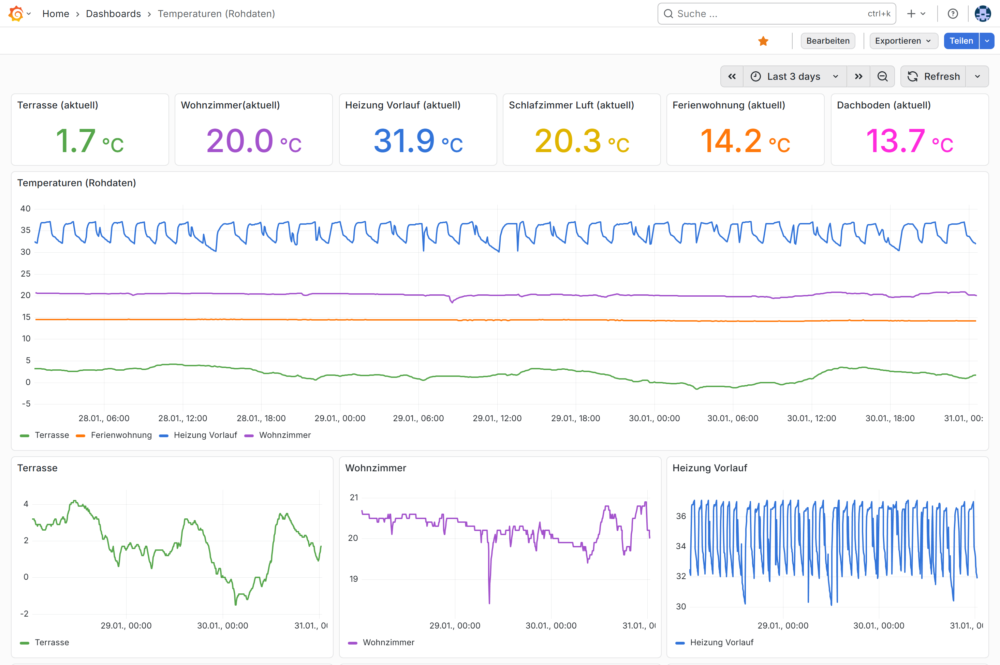
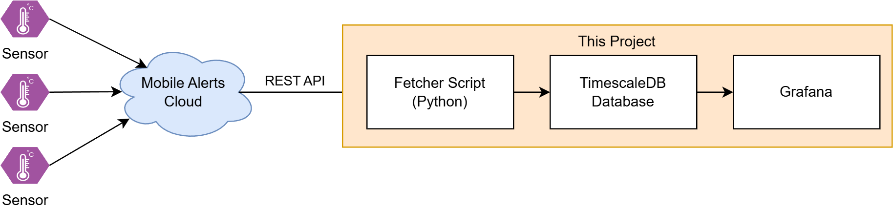

Example for a Grafana dashboard that can be built using this project

# Mobile Alerts Grafana Dashboard
This project
1. Periodically fetches the current measurements from one or multiple [Mobile Alerts](https://mobile-alerts.eu/) sensors.
2. Stores the retrieved values in a TimescaleDB database for **long-term** storage.
3. Makes the stored measurements available to a Grafana instance.

This project can be used to create a nice Grafana dashboard visualizing sensor data from your smart home.

Supported types of sensors:
- Temperature sensors with one or two temperature probes
- Humidity sensors (including combined temperature and humidity sensors)
- Rain sensors

Additional features:
- Compatible with [Traefik](https://traefik.io/traefik) for easy hosting with a domain and HTTPS
- SQL and CSV data export
- Healthcheck restarts the data fetcher if no new data arrives for more than 30 minutes

## Data Flow Diagram
This diagram visualizes the flow of data:


The Mobile Alerts REST API is documented in [this PDF file](https://mobile-alerts.eu/info/public_server_api_documentation.pdf).

## Tech Stack
- [Docker Compose](https://docs.docker.com/compose/) (everything is a container)
- [Python](https://www.python.org/) (data fetcher script)
- [TimescaleDB](https://github.com/timescale/timescaledb) for data storage
- [Grafana](https://grafana.com/) for data visualization
- [Bash](https://en.wikipedia.org/wiki/Bash_(Unix_shell)) scripts for data export

## Two options: Direct ports or Traefik
There are two options to host this project:
- **Option 1 - Direct Ports:** This option directly exposes Grafana on port 3000 of your machine.
  - Best suited when you plan to host the project inside your home network.
  - The file `docker-compose.ports.yml` corresponds to this option.
- **Option 2 - Traefik:** This makes the Grafana container available to a Traefik container that is already present on your machine.
  - You need to set up Traefik yourself. The Traefik container is not part of this project.
  - This option is best-suited when you want to host this project on a VPS. You can set up Traefik such that you can reach Grafana through a domain and have HTTPS encryption.

## Prerequisites
- Linux machine with access to the internet (to fetch data from the Mobile Alerts API)
- Docker and Docker Compose

## Getting Started
### 1. Clone the repo to your server
```bash
$ git clone https://github.com/davidaugustat/mobile-alerts-grafana.git
```
### 2. Create a `.env` File
Rename the `.env.example` file to `.env` and change at least the following values:
- `DB_PASSWORD`: Use a secure random-generated password.
- `SENSOR_IDS`: The Mobile Alerts sensor IDs you want to track as a comma-separated string (no spaces). You can find these IDs on the back of your sensor devices.
- `GF_SECURITY_ADMIN_PASSWORD`: Default password for the Grafana admin user. Use a secure random-generated password.

If you want to use the "Traefik" approach, you should also set the variable `GRAFANA_DOMAIN` to the domain where you want to host the project.

### 3. Spin up the Containers
Navigate to this repository's root directory and then run either
```bash
$ docker-compose -f docker-compose.ports.yml up -d
```
if you want to use the "Direct Ports" approach or
```bash
$ docker-compose -f docker-compose.traefik.yml up -d
```
if you want to use the "Traefik" approach.

You can then navigate to your Grafana URL, e.g. 
- `http:localhost:3000` if you used the "Direct Ports" approach or
- `https://sensors.example.com` if you used the "Traefik" approach.
There you can log in with the Grafana credentials you defined in your `.env` file.

## Configuring Grafana
TODO

## Exporting / Backups
TODO

## Room Associations (Optional)
Sometimes:
- a sensor breaks down and gets replaced by a new sensor (with a different ID)
- a sensor is moved to another room

To make database queries for specific rooms less painful in these scenarios, you can define so-called *room associations*. These allow you to associate a sensor ID with a room over a period of time.

For this purpose, copy the `config/room_assoc.yml.example` file to `config/room_assoc.yml` and create an entry for each sensor-room association.

Internally, this config file is used to populate/update the `room_assoc` table in the database on container startup.
If the `config/room_assoc.yml` file is missing, no room associations are created.

### Example
For example, let's say that a sensor with ID `0123456789AB` was in the living room and broke down on June 1st, 2025. It then got replaced by a new sensor with ID `C0FFEE123456`. The `config/room_assoc.yml` file would look like this:

```yml
associations:
  # Old sensor in living room until June 1st, 2025
  - sensor_id: 0123456789AB
    room_id: living-room
    start_date: null # from the beginning
    end_date: 2025-06-01T00:00:00Z

  # New sensor in living room since June 1st, 2025
  - sensor_id: C0FFEE123456
    room_id: living-room
    start_date: 2025-06-01T00:00:01Z
    end_date: null # until further notice
```

### How to Query Data for Specific Rooms
You can use the `room_measurements_view` view to query measurements for specific rooms. For example, to get all temperature measurements for the living room, run the following SQL query:

```sql
SELECT * FROM room_measurements_view WHERE room_id = 'living-room';
```

The `room_measurements_view` view automatically takes into account the room associations defined in the `room_assoc` table. The result will include measurements from both the old and new sensors associated with the living room over their respective time periods.

## How to Set Up Traefik (Example)
There are numerous ways to configure Traefik. Here is an example `docker-compose.yml` file for a Traefik instance.
This Traefik container:

- offers HTTPS (TLS encryption) through [Let's Encrypt](https://letsencrypt.org/)
- auto-redirects from HTTP to HTTPS
- makes use of an external Docker network `traefik-proxy`. Other Docker containers (like this project) can connect their containers to this network to make them available to Traefik.

```yaml
services:
  traefik:
    image: traefik:v3.3
    command:
      # Docker as provider:
      - "--providers.docker=true"
      - "--providers.docker.exposedbydefault=false"

      # Endpoints:
      - "--entrypoints.web.address=:80"
      - "--entrypoints.websecure.address=:443"

      # Let's Encrypt:
      - "--certificatesresolvers.myresolver.acme.tlschallenge=true"
      - "--certificatesresolvers.myresolver.acme.email=mail@example.com"
      - "--certificatesresolvers.myresolver.acme.storage=/letsencrypt/acme.json"

      # auto-redirect HTTP to HTTPS (for all services):
      - "--entrypoints.web.http.redirections.entrypoint.to=websecure"
      - "--entrypoints.web.http.redirections.entrypoint.scheme=https"

    ports:
      - "80:80"
      - "443:443"
    volumes:
      - "/var/run/docker.sock:/var/run/docker.sock:ro"
      - "letsencrypt:/letsencrypt"
    networks:
      - traefik-proxy
    restart: unless-stopped

volumes:
  letsencrypt:

networks:
  traefik-proxy:
    external: true
```

To set up Traefik:
1. Save this file in a directory `Traefik` as `docker-compose.yml`.
2. Execute the following command to create the external network `traefik-proxy`:
    ```bash
    $ docker network create traefik-proxy
    ```
3. From the `Traefik` directory run:
    ```bash
    $ docker compose up -d
    ```
    to launch Traefik.