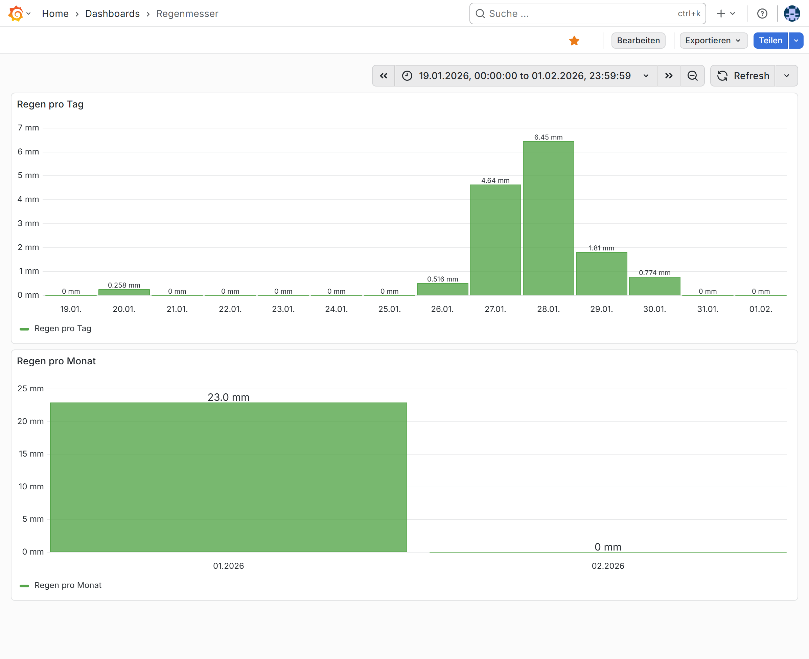

# Grafana SQL Statement Examples
This document provides example SQL statements that can be used in Grafana to query data from the TimescaleDB database.

All these queries were written with the use of LLMs but I tested all of them successfully on my personal instance of this project.

## Raw Temperature Data
Query the raw temperature data for the room with room ID `living-room`:
```sql
SELECT
  $__time("time"),
  t1 AS "Living Room"
FROM room_measurements_view
WHERE
  room_id = 'living-room'
  AND $__timeFilter("time")
ORDER BY 1;
```

## Latest Temperature Measurement
Query the latest temperature measurement for the room with room ID `living-room` or return `NULL` if no new sample arrived in the past 30 minutes:
```sql
SELECT
  COALESCE(m.time, now()) AS "time",
  CASE
    WHEN m.time >= now() - interval '30 minutes' THEN m.t1
    ELSE NULL
  END AS value
FROM (SELECT 1) AS x
LEFT JOIN LATERAL (
  SELECT time, t1
  FROM room_measurements_view
  WHERE room_id = 'living-room'
  ORDER BY time DESC
  LIMIT 1
) m ON TRUE;
```

## Average Daily Temperature
Query the average daily temperature for the room with room ID `living-room`:
```sql
SELECT
  $__timeGroupAlias("time", '1d'),
  avg(t1) AS "Living Room Daily Average"
FROM room_measurements_view
WHERE
  room_id = 'living-room'
  AND $__timeFilter("time")
GROUP BY 1
ORDER BY 1;
```

## Rain Sensor
The SQL queries for the rain sensor are surprisingly complex because the raw values from the API represent the amount of rain that fell **since the sensor was installed**. Therefore, the values cannot simply be summed up, but differences to the dates before and after need to be calculated. Additionally, the selected time range from Grafana must be extended to the beginning of the first day/month and the ending of the last day/month. All this makes the queries ridiculously long.

These queries use the sensor ID directly, instead of room associations. Queries with room IDs would work too, but in my setup they ran **a lot** slower. Maybe this can be tweaked by creating some indices or similar, but I didn't try this yet.

In Grafana the following queries can be visualized like this:


### Daily Amount
Query the daily amount of rain (mm) from the rain sensor with ID `0123456789AB` (for timezone `Europe/Berlin`):
```sql
WITH bounds AS (
  SELECT
    date_trunc('day', $__timeFrom() AT TIME ZONE 'Europe/Berlin') AS start_day,
    date_trunc('day', $__timeTo()   AT TIME ZONE 'Europe/Berlin') AS end_day
),
days AS (
  SELECT generate_series(start_day, end_day, interval '1 day') AS day_berlin
  FROM bounds
)
SELECT
  -- Grafana time column (midnight Europe/Berlin, returned as timestamptz)
  (d.day_berlin AT TIME ZONE 'Europe/Berlin') AS "time",

  -- Daily rain in mm (0 if no measurements that day)
  CASE
    WHEN last_in_day.r_last IS NULL THEN 0
    ELSE last_in_day.r_last - COALESCE(before_day.r_before, 0)
  END AS "Rain per day"
FROM days d

-- last measurement BEFORE the start of the day (Europe/Berlin day boundary)
LEFT JOIN LATERAL (
  SELECT m.r AS r_before
  FROM measurements m
  WHERE m.sensor_id = '0123456789AB'
    AND m.time < (d.day_berlin AT TIME ZONE 'Europe/Berlin')
  ORDER BY m.time DESC
  LIMIT 1
) AS before_day ON TRUE

-- last measurement INSIDE the day (Europe/Berlin day boundary)
LEFT JOIN LATERAL (
  SELECT m.r AS r_last
  FROM measurements m
  WHERE m.sensor_id = '0123456789AB'
    AND m.time >= (d.day_berlin AT TIME ZONE 'Europe/Berlin')
    AND m.time <  ((d.day_berlin + interval '1 day') AT TIME ZONE 'Europe/Berlin')
  ORDER BY m.time DESC
  LIMIT 1
) AS last_in_day ON TRUE

ORDER BY "time";
```

### Monthly Amount
Query the monthly amount of rain (mm) from the rain sensor with ID `0123456789AB` (for timezone `Europe/Berlin`):
```sql
WITH bounds AS (
  SELECT
    date_trunc('month', $__timeFrom() AT TIME ZONE 'Europe/Berlin') AS start_month,
    date_trunc('month', $__timeTo()   AT TIME ZONE 'Europe/Berlin') AS end_month
),
months AS (
  SELECT generate_series(start_month, end_month, interval '1 month') AS month_berlin
  FROM bounds
)
SELECT
  -- Grafana time column (month start Europe/Berlin, returned as timestamptz)
  (m.month_berlin AT TIME ZONE 'Europe/Berlin') AS "time",

  -- Monthly rain in mm (0 if no measurements that month)
  CASE
    WHEN last_in_month.r_last IS NULL THEN 0
    ELSE last_in_month.r_last - COALESCE(before_month.r_before, 0)
  END AS "Rain per month"
FROM months m

-- last measurement BEFORE the start of the month (Europe/Berlin boundary)
LEFT JOIN LATERAL (
  SELECT x.r AS r_before
  FROM measurements x
  WHERE x.sensor_id = '0123456789AB'
    AND x.time < (m.month_berlin AT TIME ZONE 'Europe/Berlin')
  ORDER BY x.time DESC
  LIMIT 1
) AS before_month ON TRUE

-- last measurement INSIDE the month (Europe/Berlin boundary)
LEFT JOIN LATERAL (
  SELECT x.r AS r_last
  FROM measurements x
  WHERE x.sensor_id = '0123456789AB'
    AND x.time >= (m.month_berlin AT TIME ZONE 'Europe/Berlin')
    AND x.time <  ((m.month_berlin + interval '1 month') AT TIME ZONE 'Europe/Berlin')
  ORDER BY x.time DESC
  LIMIT 1
) AS last_in_month ON TRUE

ORDER BY "time";
```
